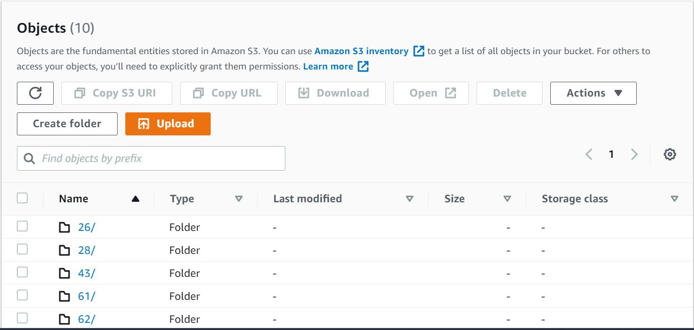
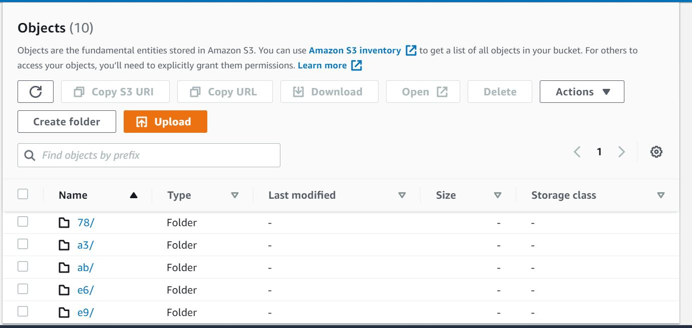

                # Week 2
                ## Part 1
        
1) Link to MLOps Assignment - https://github.com/kunalchhabra2001/MLOps_Assignment
Main contains combined dt+rf files, and exp1_dt contains only Decision tree files, and exp2_rf contains only Random Forest files

2) Commands For Part 1
> dvc init
> dvc cache dir /path/to/external_cache
> cat .dvc/config
> dvc add data/creditcard.csv
> git add data/creditcard.csv.dvc data/.gitignore
> git commit -m "Commited "
> dvc remote add -d storage s3://week2part1/dvcstore
> git add .dvc/config
> git commit -m "Configure remote storage"
> dvc push
> git push origin main

                ## Part 2
        
3) 
- Decision Tree
    - Accuracy - 0.9992451107756047
    - F1 Score - 0.7942583732057418
- Random Forests
    - Accuracy - 0.9994733330992591
    - F1 Score - 0.8255813953488371

4) 

